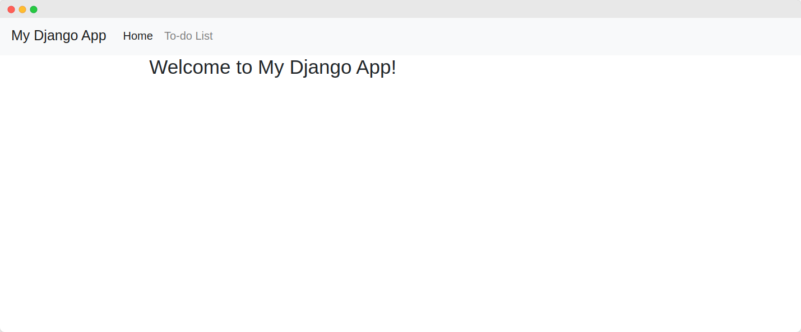
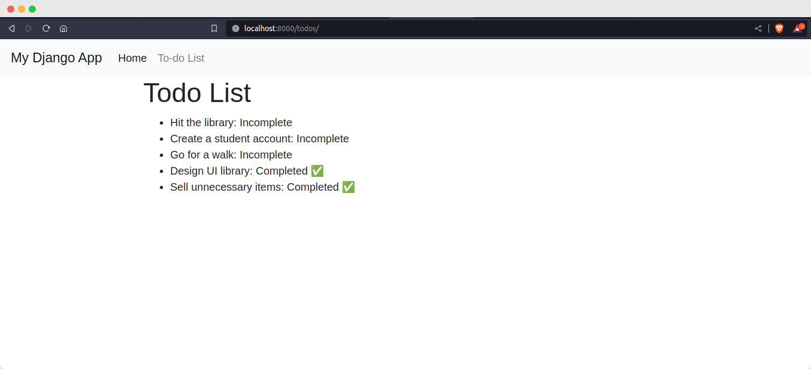

# Django - Rensyu (To-do List)

A to-do list, powered by Django (v4.2.9)

<br>

## Preview

This website consists of these page:

### Home page



<hr>

### To-do List page

A list that contains several activities, including their status (`Completed`/`Incomplete`)



<br>

## Prerequisites

Before running the app, please make sure you have following software installed in your machine:
- [Python 3](https://www.python.org/downloads/)
- [pip](https://pip.pypa.io/en/stable/installation/)
- [MySQL](https://dev.mysql.com/doc/mysql-installation-excerpt/8.0/en/)
- [Git](https://github.com/git-guides/install-git)

<br>

## How to Run

1. Create a virtual environment

```
python3 -m venv .venv
```

2. Navigate to this directory, then activate the virtual environment

```
source .venv/bin/activate
```

3. Install required packages

```python
pip3 install -r requirements.txt
```

4. Make a new file named `.env`, then copy `.env.example` and paste the content into it

```
cp .env.example .env
```

After that, fill `.env` with appropriate values

5. Create a database (Make sure you have MySQL installed in your machine beforehand)

```python
python3 mydb.py
```

6. Apply database migration

```python
python3 manage.py migrate
```

7. Create a superuser of Django admin panel

```python
python3 manage.py createsuperuser
```

You will then by asked several questions, such as `username`, `email`, and `password` of the superuser.

8. Finally, run the server!

```python
python3 manage.py runserver
```

9. Voila! Visit `http://localhost:8000` on your browser

<br>

## To-do list

- Add edit and delete buttons to modify activities
- Put available routes in the docs
- Make a Dockerfile
- Generate `requirements.txt` ✅

<br>

## Reference

- [Learn Django in 20 Minutes!! - Tech With Tim](https://www.youtube.com/watch?v=nGIg40xs9e4)
- [Jinja template](https://pastebin.com/AMzZVL12)


<br>


